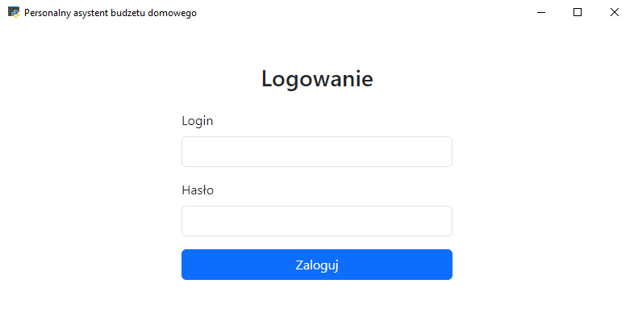
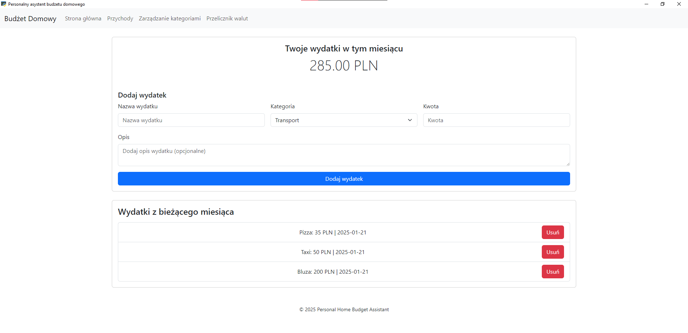
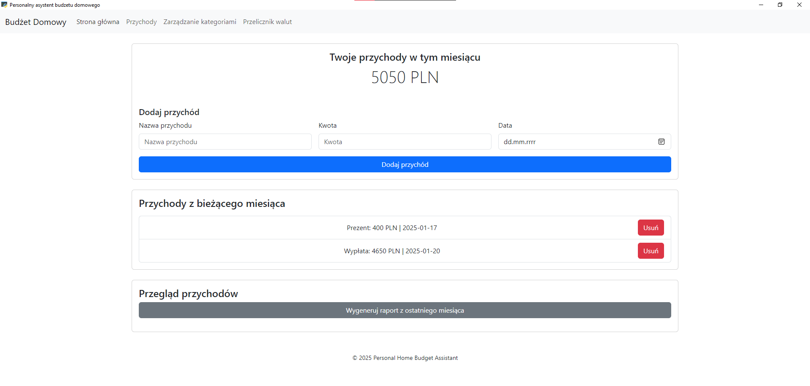
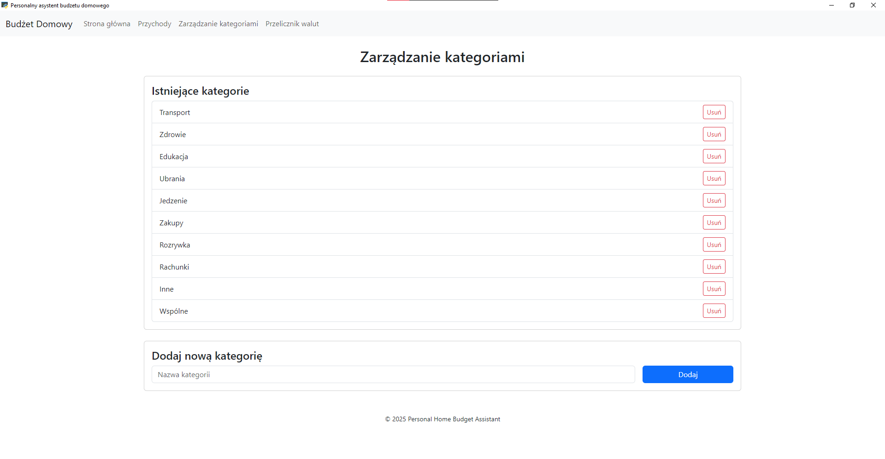
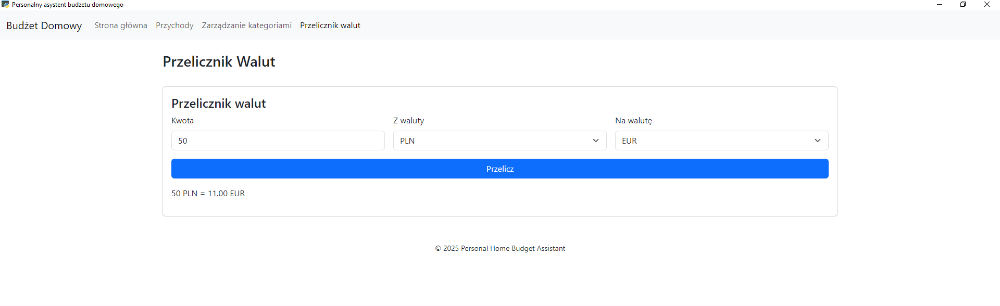

# Personal Home Budget Assistant

<div align="center">
  
  <p><em>Your personal finance companion for intelligent budget management</em></p>
</div>

[](https://www.python.org/downloads/)
[](https://flask.palletsprojects.com/)
[](https://opensource.org/licenses/MIT)

## Table of Contents

1. [Introduction](#introduction)
2. [Key Features](#key-features)
3. [Installation](#installation)
4. [Usage](#usage)
5. [System Architecture](#system-architecture)
6. [Data Management](#data-management)
7. [Security](#security)
8. [Application Preview](#application-preview)
9. [Development Team](#development-team)
10. [License](#license)
11. [Documentation](#documentation)

## Introduction

The Personal Home Budget Assistant is a comprehensive desktop application designed to help users manage their financial lives effectively. Built with a modern stack of Python and Flask, the application offers a seamless and secure way to track expenses, monitor income, and gain insights into spending patterns. With features like automatic currency conversion and detailed financial reporting, our Budget Assistant empowers users to make informed financial decisions.

## Key Features

### 🔒 User Management
- Secure account registration and authentication
- Password encryption with bcrypt
- User profile management

### 💰 Financial Tracking
- **Expense Management**: Track all expenses with detailed categorization
- **Income Recording**: Monitor multiple income streams
- **Transaction History**: Full historical view of financial activities
- **Category System**: Organize expenses into customizable categories

### 📊 Analysis & Reporting
- **Financial Reports**: Generate detailed PDF reports of your finances
- **Visualizations**: Visual representations of spending patterns
- **Monthly Summaries**: Quick overview of monthly financial activities

### 🌏 Currency Support
- **Multi-Currency Support**: Track finances in various currencies
- **Real-Time Conversion**: Currency converter with up-to-date exchange rates
- **Supports 10+ Major Currencies**: Including PLN, EUR, USD, GBP, and more

## Installation

### Prerequisites
- Python 3.8 or newer
- 20 MB of free disk space
- Internet connection (for initial setup and currency conversion features)

### Setup Process

1. **Clone the repository**
   ```bash
   git clone https://github.com/yourusername/Personalny-Asystent-Budzetu-Domowego-PWI2024.git
   cd Personalny-Asystent-Budzetu-Domowego-PWI2024
   ```

2. **Install dependencies**
   ```bash
   pip install -r requirements.txt
   ```

3. **Launch the application**
   ```bash
   python main.py
   ```

## Usage

### Getting Started

1. **Registration and Login**
   - When you first open the application, you'll be presented with a login/registration screen
   - Create an account or log in to access the dashboard

2. **Dashboard Navigation**
   - **Expenses**: Track and manage your expenses
   - **Income**: Record and view your income sources
   - **Categories**: Customize your expense categories
   - **Currency Converter**: Convert between supported currencies
   - **Reports**: Generate financial reports for selected periods

### Expense Management
- Add expenses with detailed information including date, amount, category, and notes
- View expenses by month or custom date ranges
- Delete or edit existing expense entries

### Income Tracking
- Record income from various sources with detailed descriptions
- View income history with filtering options
- Monitor total monthly income

### Generating Reports
- Access the reports section from the dashboard
- Select your desired time period
- Generate a comprehensive PDF report with income, expenses, and balance information

## System Architecture

The application is built on a robust architecture combining:

- **Frontend**: Modern HTML/CSS/JS interface rendered through Flask templates
- **Backend**: Python with Flask for server-side processing
- **Data Storage**: JSON-based file system for storing user data and settings
- **Security Layer**: Encryption and password hashing for secure data management

## Data Management

### Storage Format
All data is stored locally in structured JSON format:
- User profiles and authentication data
- Financial transactions (expenses and income)
- Categories and preferences
- Exchange rate data

### Data Integrity
- Automatic data backup
- Input validation to prevent data corruption

## Security

The application prioritizes security through:
- Password hashing using bcrypt
- Local data storage for enhanced privacy
- Input sanitization to prevent injection attacks
- Secure session management

## Application Preview

<div align="center">
  <div style="display: flex; flex-wrap: wrap; justify-content: center; gap: 10px;">
    
    
    
    
  </div>
</div>

## Development Team

- **Karol Nowocień**
- **Jakub Sternik**
- **Mateusz Kita**
- **Tobiasz Adamczyk**
- **Jan Sularz**
- **Jan Behrendt**

## Documentation

For detailed technical documentation and user guides, please refer to the [TECHNICAL.md](docs/TECHNICAL.md) file.

---

<div align="center">
  <p>© 2025 Personal Home Budget Assistant</p>
</div>
